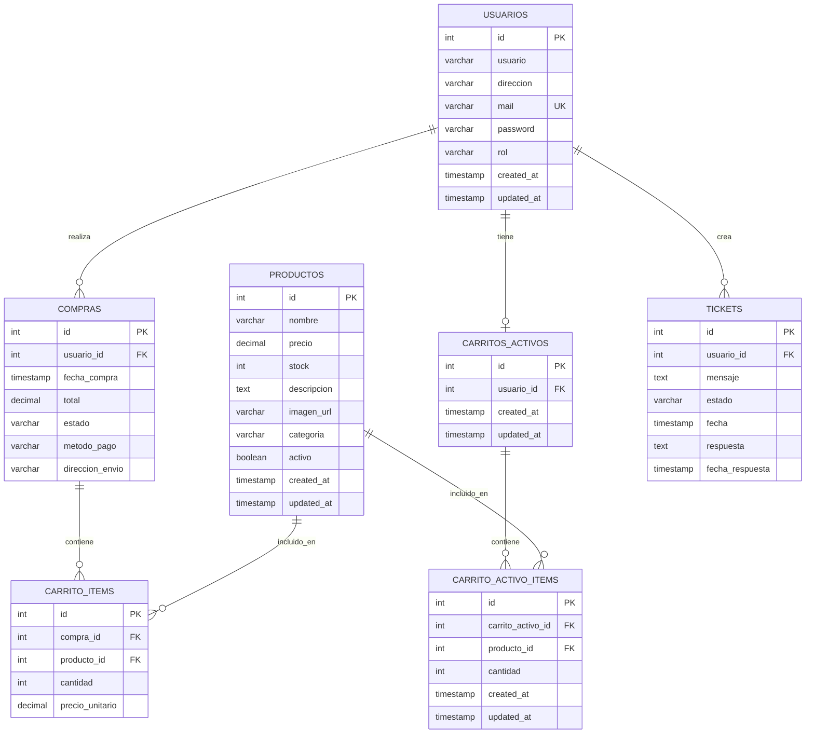

# Diagrama Entidad-Relación - Tienda Online

## Diagrama Principal (Mermaid)



## Descripción de Entidades

### 👤 USUARIOS
**Propósito**: Gestión de usuarios del sistema (clientes y administradores)

- **id**: Identificador único del usuario
- **usuario**: Nombre de usuario único (máximo 20 caracteres)
- **direccion**: Dirección física del usuario
- **mail**: Correo electrónico único para autenticación
- **password**: Contraseña encriptada con bcrypt
- **rol**: Tipo de usuario ('cliente', 'admin')
- **created_at/updated_at**: Timestamps de auditoría

### 🛍️ PRODUCTOS
**Propósito**: Catálogo de productos disponibles en la tienda

- **id**: Identificador único del producto
- **nombre**: Nombre descriptivo del producto
- **precio**: Precio en formato decimal (10,2)
- **stock**: Cantidad disponible en inventario
- **descripcion**: Descripción detallada del producto
- **imagen_url**: URL de la imagen del producto
- **categoria**: Categoría del producto para filtrado
- **activo**: Estado del producto (visible/oculto)

### 🛒 COMPRAS
**Propósito**: Registro de transacciones completadas

- **id**: Identificador único de la compra
- **usuario_id**: Referencia al usuario que realizó la compra
- **fecha_compra**: Timestamp de cuando se realizó la compra
- **total**: Monto total de la compra
- **estado**: Estado de la compra ('completada', 'pendiente', 'cancelada')
- **metodo_pago**: Método utilizado para el pago
- **direccion_envio**: Dirección de entrega

### 📦 CARRITO_ITEMS
**Propósito**: Detalle de productos en compras completadas

- **id**: Identificador único del item
- **compra_id**: Referencia a la compra
- **producto_id**: Referencia al producto
- **cantidad**: Cantidad comprada del producto
- **precio_unitario**: Precio del producto al momento de la compra

### 🛒 CARRITOS_ACTIVOS
**Propósito**: Carritos de compra en sesión (no completados)

- **id**: Identificador único del carrito
- **usuario_id**: Referencia al usuario propietario (único)
- **created_at/updated_at**: Timestamps de auditoría

### 📝 CARRITO_ACTIVO_ITEMS
**Propósito**: Productos en carritos activos

- **id**: Identificador único del item
- **carrito_activo_id**: Referencia al carrito activo
- **producto_id**: Referencia al producto
- **cantidad**: Cantidad seleccionada
- **Restricción**: Un producto solo puede aparecer una vez por carrito

### 🎫 TICKETS
**Propósito**: Sistema de soporte y comunicación con usuarios

- **id**: Identificador único del ticket
- **usuario_id**: Referencia al usuario que creó el ticket
- **mensaje**: Contenido del mensaje o consulta
- **estado**: Estado del ticket ('abierto', 'en_proceso', 'cerrado')
- **fecha**: Timestamp de creación
- **respuesta**: Respuesta del administrador
- **fecha_respuesta**: Timestamp de la respuesta

## Relaciones Clave

### 🔗 Relaciones Principales

1. **Usuario → Compras** (1:N)
   - Un usuario puede tener múltiples compras
   - Cada compra pertenece a un solo usuario

2. **Usuario → Carrito Activo** (1:1)
   - Un usuario tiene máximo un carrito activo
   - Cada carrito pertenece a un solo usuario

3. **Compra → Items de Compra** (1:N)
   - Una compra puede tener múltiples items
   - Cada item pertenece a una sola compra

4. **Producto → Items** (1:N)
   - Un producto puede estar en múltiples items
   - Cada item referencia a un solo producto

5. **Carrito Activo → Items Activos** (1:N)
   - Un carrito puede tener múltiples items
   - Cada item pertenece a un solo carrito

### 🔒 Restricciones de Integridad

- **Cascada en eliminación**: Si se elimina un usuario, se eliminan sus compras, carrito y tickets
- **Unicidad**: Email de usuario y combinación carrito-producto únicos
- **Valores por defecto**: Timestamps automáticos, estados iniciales

## Índices de Rendimiento

### 📊 Índices Principales

```sql
-- Búsquedas frecuentes
idx_usuarios_mail          -- Login por email
idx_productos_categoria    -- Filtrado por categoría
idx_compras_usuario        -- Historial de compras
idx_compras_fecha         -- Reportes por fecha

-- Optimización de joins
idx_carrito_items_compra   -- Items por compra
idx_carrito_items_producto -- Productos en items
idx_tickets_usuario        -- Tickets por usuario
```

## Flujo de Datos

### 🔄 Proceso de Compra

1. **Navegación**: Usuario explora productos
2. **Selección**: Productos se agregan al carrito activo
3. **Checkout**: Carrito activo se convierte en compra
4. **Finalización**: Items activos se copian a items de compra
5. **Limpieza**: Carrito activo se vacía

### 📈 Métricas y Análisis

- **Ventas**: Suma de totales en compras por período
- **Productos populares**: Count de items por producto
- **Usuarios activos**: Usuarios con compras recientes
- **Carritos abandonados**: Carritos activos sin actividad

## Consideraciones Técnicas

### ⚡ Optimización

- Índices en campos de búsqueda frecuente
- Timestamps para auditoría y análisis temporal
- Soft delete mediante campo 'activo' en productos

### 🔐 Seguridad

- Contraseñas encriptadas con bcrypt
- Validación de roles para operaciones administrativas
- Restricciones de integridad referencial

### 📱 Escalabilidad

- Estructura preparada para múltiples categorías
- Sistema de tickets extensible
- Separación clara entre carritos activos y compras

---

**Última actualización**: Diciembre 2024  
**Versión**: 1.0  
**Autor**: Sistema de Documentación Automática